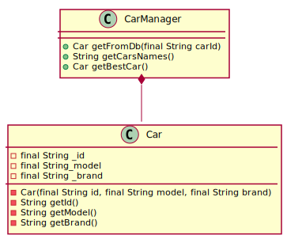
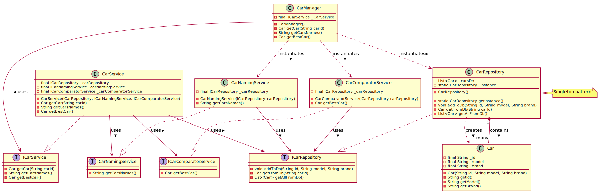
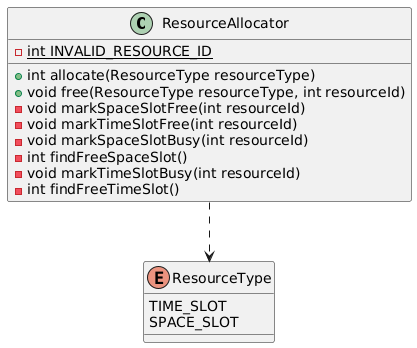
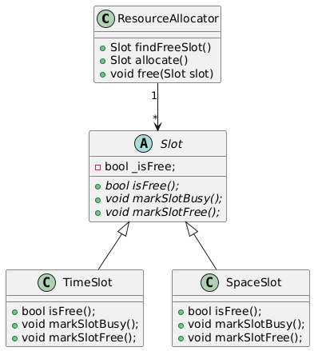

# SOLID Principles

This repository is made in the context of a Software Architecture Course by [Dr. Lilia Sfaxi](https://insatunisia.github.io/TP-ArchLog/tp1/)

This is our lab report. It was made by:

- Raed Addala [@RaedAddala](https://www.github.com/RaedAddala)
- Mohamed Aziz Ben Ghorbel [@AziizBg](https://www.github.com/AziizBg)
- Zied Maghraoui [@ZiedMaghraoui](https://www.github.com/ZiedMaghraoui)
- Mohamed Zouaghi [@zouaghista](https://www.github.com/zouaghista)

## SRP( Single Responsability Principle)

Following the SRP, we refactored the classes found in `./SRP/src/exercise` into `./SRP/src/exercise_refactored`.

We split `CarManager` class into `CarManager` and `CarRepository` where the later will handle CRUD operations to the Database (in-memory database).
Here is the old classes diagram UML:

<!--
@startuml oldSRPDiagram
class CarManager {
    + Car getFromDb(final String carId)
    + String getCarsNames()
    + Car getBestCar()
}
class Car{
    - final String _id
    - final String_model
    - final String _brand
- Car(final String id, final String model, final String brand)
- String getId()
- String getModel()
- String getBrand()
}
CarManager *-- Car
@enduml
-->

Here is the new classes diagram UML:

<!--
@startuml newSRPDiagram
class CarManager {
    + Car getCar(String carId)
    + String getCarsNames()
    + Car getBestCar()
}
class CarRepository{
    + void addToDb(final String id, final String model, final String brand)
    + Car getFromDb(final String carId)
    + List<Car> getAllFromDb()
}
class Car{
    - final String _id
    - final String_model
    - final String _brand
- Car(final String id, final String model, final String brand)
- String getId()
- String getModel()
- String getBrand()
}
CarRepository "1" *-- "many" Car
CarManager --o CarRepository
@enduml
-->

## OCP(Open/Closed Principle)

- Following the OCP, we refactored the classes found in `./OCP/src/exercise` into `./OCP/src/solution`.
- We added an abstract class `Slot` and two concrete classes `TimeSlot` and `SpaceSlot` that inherit from `Slot`.
- We removed the checks for the type of the slot in the `ResourceAllocator` class and used the abstract class `Slot` instead.
- We also added a new method `findFreeSlot` to the `ResourceAllocator` class that will return the first free slot it finds in the list of slots using the `isFree` method of the `Slot` class.
  Here is the old classes diagram UML:

Here is the new classes diagram UML:

