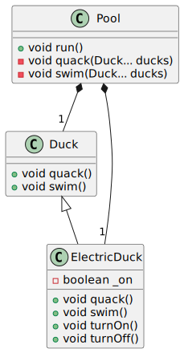
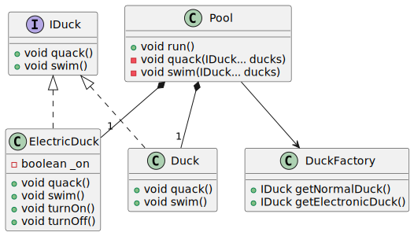

# SOLID Principles

This repository is made in the context of a Software Architecture Course by [Dr. Lilia Sfaxi](https://insatunisia.github.io/TP-ArchLog/tp1/)

This is our lab report. It was made by:

- Raed Addala [@RaedAddala](https://www.github.com/RaedAddala)
- Mohamed Aziz Ben Ghorbel [@AziizBg](https://www.github.com/AziizBg)
- Zied Maghraoui [@ZiedMaghraoui](https://www.github.com/ZiedMaghraoui)
- Mohamed Zouaghi [@zouaghista](https://www.github.com/zouaghista)

## SRP( Single Responsability Principle)

Following the SRP, we refactored the classes found in `./SRP/src/exercise` into `./SRP/src/exercise_refactored`.

We split `CarManager` class into `CarManager` and `CarRepository` where the later will handle CRUD operations to the Database (in-memory database).

Here is the old classes diagram UML:

Here is the new classes diagram UML:

## OCP (Open/Closed Principle)

- Following the OCP, we refactored the classes found in `./OCP/src/exercise` into `./OCP/src/solution`.
- We added an abstract class `Slot` and two concrete classes `TimeSlot` and `SpaceSlot` that inherit from `Slot`.
- We removed the checks for the type of the slot in the `ResourceAllocator` class and used the abstract class `Slot` instead.
- We also added a new method `findFreeSlot` to the `ResourceAllocator` class that will return the first free slot it finds in the list of slots using the `isFree` method of the `Slot` class.
  Here is the old classes diagram UML:

Here is the new classes diagram UML:

## LSP (Liskov Substitution Principle)

Following the LSP, we refactored the classes found in `./LSP/src/exercise` into `./LSP/src/exercise_refactored`.

Instead of having `ElectronicDuck` inherit from `Duck`, we extracted the quacking and swimming behavior into the `IDuck` interface, we also created a `DuckFactory` class which will handle duck initialization.
 

Here is the old classes diagram UML:
<!--
@startuml oldLSPDiagram
class Duck{
+void quack()
+void swim()
}
Class ElectricDuck{
+void quack()
+void swim()
+void turnOn()
+void turnOff()
-boolean _on
}
Class Pool{
+void run()
-void quack(Duck... ducks)
-void swim(Duck... ducks)
}
Duck <|-- ElectricDuck
Pool *-- "1" Duck
Pool *-- "1" ElectricDuck
@enduml
-->

Here is the new classes diagram UML:

## ISP (Interface Segregation Principle)

## DIP (Dependency Inversion Principle)

- Following the DIP, we refactored the classes found in `./DIP/src/../exercise` into `./DIP/src/../solution`.
- We introduced two interfaces:
  - `IReader` for reading input from various sources (e.g., files, network).
  - `IWriter` for writing encoded output to different destinations (e.g., files, databases).
- We implemented `IReader` and `IWriter` with the following concrete classes:
  - `FileReaderModule` (reads from files).
  - `NetworkReaderModule` (fetches data from a URL).
  - `FileWriterModule` (writes encoded data to a file).
  - `DatabaseWriterModule` (stores encoded data in a database).
- The `EncodingModule` was modified to depend on the abstractions `IReader` and `IWriter`, making it independent of specific data sources and storage mechanisms.
- We removed direct dependencies on concrete classes like `BufferedReader`, `FileReader`, and `MyDatabase`
- This change makes the code more **extensible**, **testable**, and **maintainable**.
  
### Old Class Diagram:

### New Class Diagram after Applying DIP:

